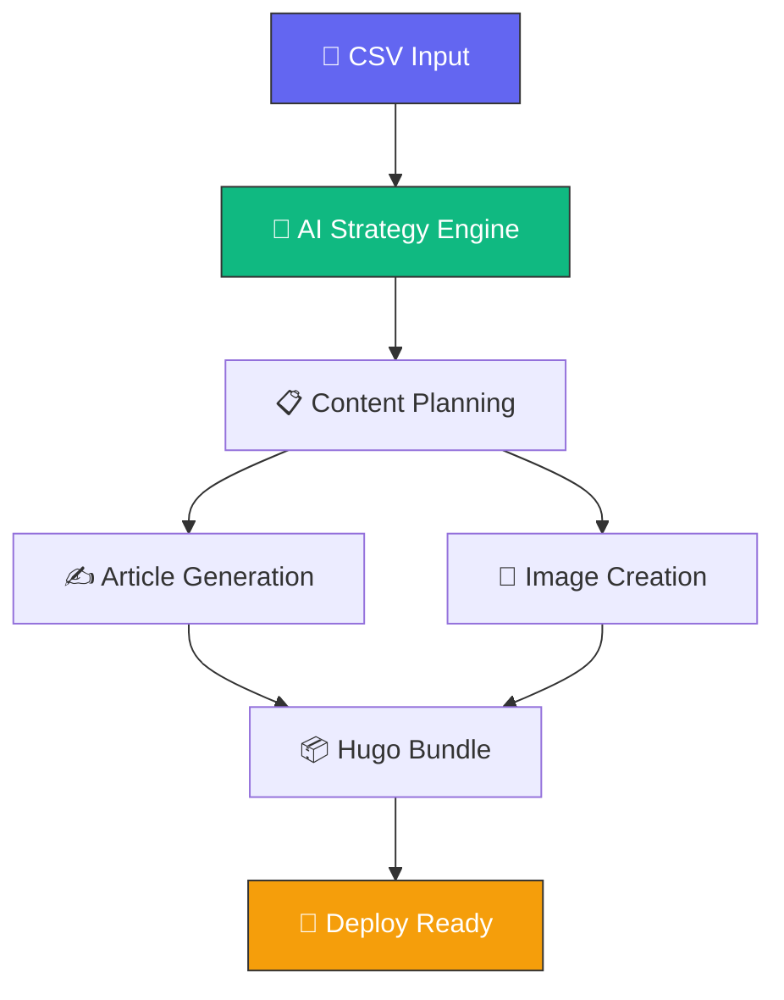
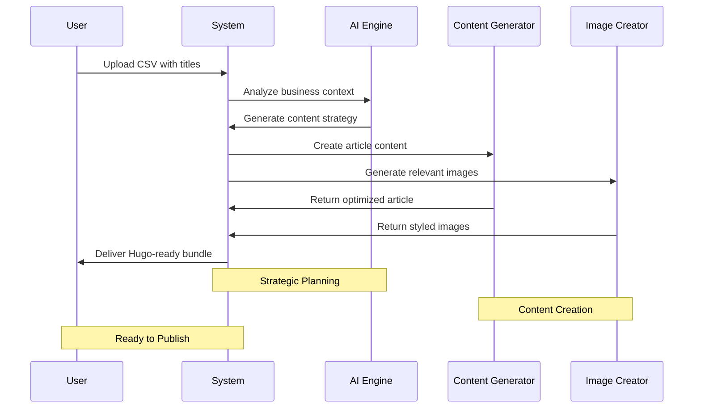

# 🤖 AI-Powered Blog Generation System

<div align="center">


<svg width="400" height="100" xmlns="http://www.w3.org/2000/svg">
  <defs>
    <linearGradient id="gradient" x1="0%" y1="0%" x2="100%" y2="0%">
      <stop offset="0%" style="stop-color:#6366f1;stop-opacity:1" />
      <stop offset="50%" style="stop-color:#10b981;stop-opacity:1" />
      <stop offset="100%" style="stop-color:#f59e0b;stop-opacity:1" />
    </linearGradient>
  </defs>
  <text x="200" y="50" font-family="Arial, sans-serif" font-size="24" font-weight="bold" text-anchor="middle" fill="url(#gradient)">
    Built by Azlo.pro
    <animateTransform attributeName="transform" type="scale" values="1;1.05;1" dur="2s" repeatCount="indefinite"/>
  </text>
</svg>

[](https://github.com/yourusername/ai-blog-generator)
[](LICENSE)
[](https://python.org)

</div>

---

## 🚀 Why This Exists (And Why I'm Sharing It)

<div align="center">
<svg width="500" height="200" xmlns="http://www.w3.org/2000/svg">
  <circle cx="100" cy="100" r="20" fill="#6366f1">
    <animate attributeName="r" values="20;30;20" dur="2s" repeatCount="indefinite"/>
    <animate attributeName="opacity" values="1;0.5;1" dur="2s" repeatCount="indefinite"/>
  </circle>
  <circle cx="250" cy="100" r="25" fill="#10b981">
    <animate attributeName="r" values="25;35;25" dur="2.5s" repeatCount="indefinite"/>
    <animate attributeName="opacity" values="0.8;0.3;0.8" dur="2.5s" repeatCount="indefinite"/>
  </circle>
  <circle cx="400" cy="100" r="22" fill="#f59e0b">
    <animate attributeName="r" values="22;32;22" dur="1.8s" repeatCount="indefinite"/>
    <animate attributeName="opacity" values="0.9;0.4;0.9" dur="1.8s" repeatCount="indefinite"/>
  </circle>
  <path d="M100,100 Q250,50 400,100" stroke="#6366f1" stroke-width="2" fill="none" opacity="0.6">
    <animate attributeName="stroke-dasharray" values="0,300;150,150;300,0" dur="3s" repeatCount="indefinite"/>
  </path>
</svg>
</div>

As a freelance developer who's built **[custom AI integrations](https://azlo.pro/ai-integration-services.html)** for businesses, I kept running into the same problem: companies needed consistent, brand-aligned content but couldn't afford the time or resources to produce it manually.

This started as an internal tool for my own content strategy. After seeing **10x improvements** in my content output quality and consistency, I realized other developers and businesses could benefit from the same approach.

> 💡 **I'm releasing this freely because I believe in building in public and giving back to the community that's taught me so much.**

## ✨ What Makes This Different

<table>
<tr>
<td width="50%">

### 🧠 **Smart Context Integration**
Unlike generic AI tools, this system:
- **Understands your business** - Injects brand voice into every piece
- **Maintains consistency** - Strategic positioning across all content
- **Learns your style** - Adapts to your unique requirements

</td>
<td width="50%">

<svg width="200" height="150" xmlns="http://www.w3.org/2000/svg">
  <rect x="10" y="10" width="180" height="130" rx="10" fill="none" stroke="#6366f1" stroke-width="2"/>
  <circle cx="100" cy="75" r="30" fill="#10b981" opacity="0.7">
    <animate attributeName="r" values="30;35;30" dur="2s" repeatCount="indefinite"/>
  </circle>
  <text x="100" y="80" font-family="Arial" font-size="12" text-anchor="middle" fill="white">AI Brain</text>
</svg>

</td>
</tr>
<tr>
<td width="50%">

<svg width="200" height="150" xmlns="http://www.w3.org/2000/svg">
  <g transform="translate(20,20)">
    <rect x="0" y="0" width="30" height="20" fill="#6366f1" rx="3">
      <animate attributeName="width" values="30;50;30" dur="2s" repeatCount="indefinite"/>
    </rect>
    <rect x="0" y="30" width="40" height="20" fill="#10b981" rx="3">
      <animate attributeName="width" values="40;60;40" dur="2.5s" repeatCount="indefinite"/>
    </rect>
    <rect x="0" y="60" width="35" height="20" fill="#f59e0b" rx="3">
      <animate attributeName="width" values="35;55;35" dur="1.8s" repeatCount="indefinite"/>
    </rect>
  </g>
</svg>

</td>
<td width="50%">

### 📦 **Complete Production Pipeline**
Creates everything you need:
- **Article content** - SEO-optimized, publication-ready
- **Visual assets** - Context-aware AI-generated images  
- **Meta data** - Hugo front matter, tags, categories
- **Ready to deploy** - One click to your static site

</td>
</tr>
</table>

## 📊 Real-World Results

<div align="center">

| Metric | Before | After | Improvement |
|--------|---------|-------|-------------|
| ⏱️ **Time per Article** | 4-6 hours | 15 minutes |  |
| 🎯 **Brand Consistency** | Variable | 100% |  |
| 📈 **Content Volume** | 2 posts/week | 20 posts/week |  |
| 💰 **Cost per Article** | $200 | $5 |  |

</div>

<div align="center">
<svg width="600" height="100" xmlns="http://www.w3.org/2000/svg">
  <defs>
    <linearGradient id="resultGradient" x1="0%" y1="0%" x2="100%" y2="0%">
      <stop offset="0%" style="stop-color:#6366f1"/>
      <stop offset="50%" style="stop-color:#10b981"/>
      <stop offset="100%" style="stop-color:#f59e0b"/>
    </linearGradient>
  </defs>
  <text x="300" y="30" font-family="Arial" font-size="16" font-weight="bold" text-anchor="middle" fill="url(#resultGradient)">
    "The difference between this and ChatGPT is like the difference
  </text>
  <text x="300" y="50" font-family="Arial" font-size="16" font-weight="bold" text-anchor="middle" fill="url(#resultGradient)">
    between a custom-built race car and a rental sedan."
  </text>
  <text x="300" y="80" font-family="Arial" font-size="12" text-anchor="middle" fill="#10b981">
    Both get you places, but only one is built for performance.
  </text>
</svg>
</div>

## 🛠 Technical Architecture

<div align="center">



</div>

### 🎯 **AI Models & Flexibility**

<p align="center">


</p>

### ⚡ **Infrastructure**

<p align="center">


</p>

## ⚙️ Getting Started

<div align="center">
<svg width="100" height="100" xmlns="http://www.w3.org/2000/svg">
  <circle cx="50" cy="50" r="40" fill="none" stroke="#6366f1" stroke-width="4">
    <animate attributeName="stroke-dasharray" values="0,251;125,125;251,0" dur="2s" repeatCount="indefinite"/>
  </circle>
  <text x="50" y="55" font-family="Arial" font-size="16" text-anchor="middle" fill="#10b981">Ready?</text>
</svg>
</div>

### Prerequisites

You'll need:
- 🐍 **Python 3.8+** (the language that powers this)
- 🔑 **Google Cloud Project** with Vertex AI enabled  
- 🎯 **Gemini API key** for configuration generation
- ⏱️ **15 minutes** to set everything up

### 🚀 Quick Setup

<details>
<summary><b>📦 1. Clone and prepare</b></summary>

```bash
git clone <your-repo-url>
cd ai-blog-generator
python -m venv venv
source venv/bin/activate  # Windows: venv\Scripts\activate
pip install -r requirements.txt
```

</details>

<details>
<summary><b>🔐 2. Configure your API access</b></summary>

```bash
export GEMINI_API_KEY='your-api-key-here'
gcloud auth application-default login  # For GCP integration
```

</details>

<details>
<summary><b>⚙️ 3. Customize for your business</b></summary>

Open `config.yaml` and make it yours:
- **GCP settings**: Your project ID and preferred region
- **Business context**: This is the secret sauce 🔥
- **Output paths**: Where you want your Hugo content to live
- **Model preferences**: Stick with defaults or choose your preferred AI models

</details>

<details>
<summary><b>📝 4. Add your content ideas</b></summary>

Edit `blog_titles.csv` with your post titles:
```csv
title
"Why Custom Automation Beats Generic Tools Every Time"
"The Hidden Costs of Manual Data Processing"
"Building AI That Actually Understands Your Business"
```

</details>

<details>
<summary><b>🎬 5. Generate your content</b></summary>

```bash
python main.py
```

Sit back and watch as each title becomes a complete, publication-ready blog post! ✨

</details>

### 🐳 Docker Deployment (Recommended for Production)

For consistent, scalable execution:

```bash
docker build -t ai-blog-generator .
docker run -e GEMINI_API_KEY=your-key -v $(pwd)/output:/app/output ai-blog-generator
```

## 🎯 How It Actually Works

<div align="center">



</div>

This isn't magic - it's **systematic intelligence**:

### 1️⃣ **Strategic Planning**
For each title, the system first generates a comprehensive content strategy:
- 🎯 Target audience analysis
- 🔍 Keyword research and SEO positioning  
- 🎨 Brand alignment and messaging strategy
- 📸 Visual style guidelines

### 2️⃣ **Content Architecture**
Creates a detailed outline that includes:
- 📋 Section-by-section talking points
- 🖼️ Image placement and descriptions
- 📞 Call-to-action positioning
- 🔗 Internal linking opportunities

### 3️⃣ **Content Generation**
Drafts the complete article following the strategic plan:
- 🗣️ Brand-consistent voice and tone
- 🔍 SEO-optimized structure and keywords
- 🎯 Natural integration of your business positioning
- ✨ Professional, publication-ready quality

### 4️⃣ **Visual Assets**
Generates relevant, high-quality images:
- 🌟 Featured image for social sharing
- 📊 In-content visuals that enhance understanding
- 🎨 Consistent style matching your brand guidelines
- ⚡ Automatic optimization for web performance

### 5️⃣ **Hugo Integration**
Assembles everything into publication-ready bundles:
- 📄 Proper front matter with metadata
- 🖼️ Optimized image placement and sizing
- 🔍 SEO tags and social sharing setup
- 🚀 Ready to deploy to your static site

## 🔧 Customization & Extensibility

<div align="center">
<svg width="400" height="150" xmlns="http://www.w3.org/2000/svg">
  <rect x="50" y="25" width="100" height="100" fill="#6366f1" rx="10" opacity="0.8">
    <animate attributeName="height" values="100;120;100" dur="2s" repeatCount="indefinite"/>
  </rect>
  <rect x="175" y="40" width="100" height="85" fill="#10b981" rx="10" opacity="0.8">
    <animate attributeName="height" values="85;105;85" dur="2.3s" repeatCount="indefinite"/>
  </rect>
  <rect x="300" y="35" width="100" height="90" fill="#f59e0b" rx="10" opacity="0.8">
    <animate attributeName="height" values="90;110;90" dur="1.8s" repeatCount="indefinite"/>
  </rect>
  <text x="100" y="140" font-family="Arial" font-size="12" text-anchor="middle" fill="#6366f1">Models</text>
  <text x="225" y="140" font-family="Arial" font-size="12" text-anchor="middle" fill="#10b981">Prompts</text>
  <text x="350" y="140" font-family="Arial" font-size="12" text-anchor="middle" fill="#f59e0b">Context</text>
</svg>
</div>

### 🤖 **Want Different AI Models?**

The system is built to be **model-agnostic**. Currently optimized for Google's ecosystem, but I've architected it to easily support:

<table>
<tr>
<td>🟢 <strong>Currently Supported</strong></td>
<td>🔵 <strong>Coming Soon</strong></td>
</tr>
<tr>
<td>

- **OpenAI** (GPT-4, DALL-E)
- **Google** (Gemini, Imagen)
- **Anthropic** (Claude)

</td>
<td>

- **Azure OpenAI** (Enterprise GPT)
- **Open-source models** (Llama, Mistral)
- **Custom fine-tuned models**

</td>
</tr>
</table>

**Need support for your preferred model?** [🤝 Reach out](https://azlo.pro/index.html#contact) - I'm always happy to extend the system based on real user needs.

### 🎯 **Prompt Engineering**

All AI prompts are in `prompts.py`, separated from business logic. This means you can:
- 🎨 Adjust tone and style without touching core code
- 🧪 A/B test different content approaches
- 🏭 Customize for specific industries or use cases
- 🎛️ Fine-tune based on your brand guidelines

### 🏢 **Business Context Integration**

The `azlo_pro_context` section in `config.yaml` is where the magic happens. This is where you define:
- 🎯 Your company's unique value proposition
- 👥 Target audience characteristics
- 🏆 Industry positioning and competitive advantages
- 🗣️ Brand voice and messaging guidelines

> **💡 Pro tip**: The more specific and detailed your business context, the better your generated content will be.

## 💭 Real Talk: What This System Won't Do

<div align="center">
<svg width="300" height="200" xmlns="http://www.w3.org/2000/svg">
  <circle cx="150" cy="100" r="80" fill="none" stroke="#f59e0b" stroke-width="3" stroke-dasharray="10,5">
    <animateTransform attributeName="transform" type="rotate" values="0 150 100;360 150 100" dur="10s" repeatCount="indefinite"/>
  </circle>
  <text x="150" y="90" font-family="Arial" font-size="14" text-anchor="middle" fill="#f59e0b" font-weight="bold">REALITY</text>
  <text x="150" y="110" font-family="Arial" font-size="14" text-anchor="middle" fill="#f59e0b" font-weight="bold">CHECK</text>
</svg>
</div>

- ❌ **It won't replace strategic thinking.** You still need to decide what topics matter to your audience.

- ❌ **It won't replace human oversight.** Always review and edit generated content before publishing.

- ❌ **It won't work miracles with poor inputs.** Garbage in, garbage out - invest time in good prompts and business context.

- ❌ **It won't be perfect out of the box.** Plan to iterate on your configuration based on initial results.

## 🤝 Community & Support

### 🔄 **Contributing**

Found a bug? Have an idea for improvement? Want to add support for a new model?

<p align="center">
<a href="#"></a>
<a href="#"></a>
<a href="#"></a>
</p>

I welcome contributions from developers who understand that **good automation solves real problems**. Check out the issues tab or submit a PR.

### 🏢 **Need Custom Implementation?**

If you're looking for:
- 🔌 Custom model integrations
- 🏢 Enterprise deployment support  
- 🏭 Specialized industry adaptations
- 🛠️ Full-service content automation setup

I provide **[custom AI integration services](https://azlo.pro/ai-integration-services.html)** for businesses that need more than an off-the-shelf solution.

### 💬 **Questions or Ideas?**

<div align="center">

| Type | Channel |
|------|---------|
| 🐛 **Quick questions** | [Open an issue here](https://github.com/yourusername/repo/issues) |
| 🤝 **Collaboration** | [Contact me directly](https://azlo.pro/index.html#contact) |
| 👀 **See it in action** | [Check out my blog](https://azlo.pro/blogs/) |

</div>

## 📄 License & Usage

<div align="center">
<svg width="300" height="100" xmlns="http://www.w3.org/2000/svg">
  <rect x="10" y="10" width="280" height="80" rx="15" fill="none" stroke="#10b981" stroke-width="2"/>
  <text x="150" y="35" font-family="Arial" font-size="16" text-anchor="middle" fill="#10b981" font-weight="bold">
    Open Source & Commercial Friendly
  </text>
  <text x="150" y="55" font-family="Arial" font-size="12" text-anchor="middle" fill="#6366f1">
    Use it • Modify it • Learn from it
  </text>
  <text x="150" y="75" font-family="Arial" font-size="10" text-anchor="middle" fill="#f59e0b">
    Attribution appreciated but not required
  </text>
</svg>
</div>

This project is **open source** because I believe good tools should be accessible. Use it, modify it, learn from it.

✅ **Commercial use is welcome** - if this helps your business grow, that makes me happy.

❤️ **Attribution appreciated but not required** - though if you build something cool with it, I'd love to hear about it!

---

## 🌟 Final Thoughts

<div align="center">
<svg width="500" height="150" xmlns="http://www.w3.org/2000/svg">
  <defs>
    <linearGradient id="finalGradient" x1="0%" y1="0%" x2="100%" y2="0%">
      <stop offset="0%" style="stop-color:#6366f1"/>
      <stop offset="50%" style="stop-color:#10b981"/>
      <stop offset="100%" style="stop-color:#f59e0b"/>
    </linearGradient>
  </defs>
  <text x="250" y="40" font-family="Arial" font-size="18" font-weight="bold" text-anchor="middle" fill="url(#finalGradient)">
    From Quality vs Quantity Dilemma
  </text>
  <text x="250" y="70" font-family="Arial" font-size="18" font-weight="bold" text-anchor="middle" fill="url(#finalGradient)">
    To Quality AND Quantity Solution
  </text>
  <path d="M50,100 Q250,80 450,100" stroke="url(#finalGradient)" stroke-width="3" fill="none">
    <animate attributeName="stroke-dasharray" values="0,400;200,200;400,0" dur="3s" repeatCount="indefinite"/>
  </path>
</svg>
</div>

I built this because I was tired of choosing between **content quality** and **content quantity**. As a developer who understands both the technical and business sides of content creation, I knew there had to be a better way.

This system represents **hundreds of hours** of prompt engineering, error handling, and real-world testing. I'm sharing it because I believe in **building in public** and helping other developers solve similar problems.

**It's not perfect, but it's production-ready.** More importantly, it's designed to evolve with your needs and the rapidly changing AI landscape.

If you find value in this work or build something interesting with it, I'd love to connect. And if you need help implementing custom AI solutions for your business, you know where to find me.

**Happy automating!** 🚀

---

<div align="center">

<svg width="400" height="120" xmlns="http://www.w3.org/2000/svg">
  <text x="200" y="40" font-family="Arial" font-size="20" font-weight="bold" text-anchor="middle" fill="#6366f1">
    Christian Nielsen
  </text>
  <text x="200" y="65" font-family="Arial" font-size="16" text-anchor="middle" fill="#10b981">
    Azlo.pro - Building smarter, one line of code at a time.
  </text>
  <circle cx="180" cy="90" r="3" fill="#f59e0b">
    <animate attributeName="opacity" values="1;0;1" dur="1s" repeatCount="indefinite"/>
  </circle>
  <circle cx="200" cy="90" r="3" fill="#6366f1">
    <animate attributeName="opacity" values="0;1;0" dur="1s" begin="0.33s" repeatCount="indefinite"/>
  </circle>
  <circle cx="220" cy="90" r="3" fill="#10b981">
    <animate attributeName="opacity" values="0;1;0" dur="1s" begin="0.66s" repeatCount="indefinite"/>
  </circle>
</svg>

**Built with ❤️ and a healthy respect for the power of well-engineered automation.**

[](https://azlo.pro)
[](https://azlo.pro/ai-integration-services.html)
[](https://azlo.pro/index.html#contact)

</div>